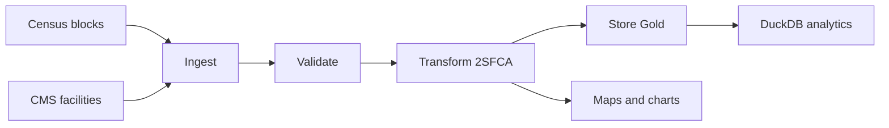

# Healthcare Accessibility Research

[](https://github.com/yourusername/healthcare-accessibility-research/actions)
[](https://www.python.org/)
[](LICENSE)

This repository extends my paper on spatial accessibility by turning the DC Census block analysis into a reproducible data pipeline. The research core is the SDW-2SFCA, and the engineering layer packages that method into ingestion, validation, transformation, orchestration, storage, analytics, and visualization components.

The main story of the project is simple: compute healthcare accessibility for census blocks, validate the data, automate the workflow with DAGs, and make the outputs easy to inspect and reproduce.

## What’s In The Repo

- `pipeline/` contains the runnable implementation for ingesting Census and CMS data, validating it, computing accessibility, and writing outputs.
- `dags/accessibility_pipeline_dag.py` wires the stages into an Airflow workflow.
- `dashboard/` contains the Streamlit dashboard for exploring accessibility results.
- `case_studies/` stores the per-city configuration used to reproduce the analyses.
- `outputs/figures/` contains the generated maps and comparison plots shown below.
- `notebooks/` documents the exploratory analysis and method development that informed the pipeline.

## Study Design

The repository currently focuses on the Washington, D.C. case study from the paper and the same pipeline pattern can be reused for other cities and facility types.

| Study | Facility Type | Census Blocks | Catchment Radius | CRS |
|---|---:|---:|---:|---|
| Washington, D.C. | Intermediate Care Facilities | ~6,000 | 900 m | EPSG:26985 |
| New York City | Dialysis Facilities | ~38,000 | 1,200 m | EPSG:32618 |

Run a case study with:

```bash
python run_pipeline.py --config case_studies/dc.yaml
python run_pipeline.py --config case_studies/nyc.yaml
```

See [`case_studies/README.md`](case_studies/README.md) for the required fields and configuration notes.

## Method

The accessibility score is based on 2SFCA, with two practical extensions used in the paper implementation:

1. Truncated Gaussian distance decay so influence drops to zero at the catchment boundary.
2. Sociodemographic demand weighting so blocks are not treated as equally burdened when income, insurance coverage, and working-age population differ.

The implementation uses `scipy.cKDTree` to keep the spatial search efficient as the number of blocks and facilities grows.

## Pipeline

The pipeline follows a Bronze → Silver → Gold pattern and is orchestrated by Airflow.



Current DAG task order:

`ingest_census` + `ingest_cms` → `validate_silver` → `transform_2sfca` → `build_analytics`

The same stages can also be run locally through `run_pipeline.py`.

## Results

### Washington, D.C. Accessibility Map


### Method Comparison Maps


### Inequality Comparison


For the broader comparison set, see [`outputs/figures/enhanced_2sfca_accessibility.png`](outputs/figures/enhanced_2sfca_accessibility.png), [`outputs/figures/gravity_accessibility.png`](outputs/figures/gravity_accessibility.png), and [`outputs/figures/hansen_accessibility.png`](outputs/figures/hansen_accessibility.png).

## Dashboard

The Streamlit dashboard lets you inspect the computed surfaces interactively.

```bash
pip install -r requirements-dev.txt
streamlit run dashboard/enhanced_2sfca_dashboard.py
```

If you have a Census API key or S3-backed data available, the dashboard will use them; otherwise it can fall back to local data where configured.

## Quick Start

```bash
pip install -r requirements-dev.txt
make pytest
python run_pipeline.py --config case_studies/dc.yaml
```

## Project Structure

```
├── case_studies/
├── dashboard/
├── dags/
├── docs/
├── notebooks/
├── outputs/
├── pipeline/
├── tests/
├── Dockerfile
├── docker-compose.yml
├── Makefile
└── requirements.txt
```

## References

- Luo, W., & Wang, F. (2003). Measures of spatial accessibility to health care in a GIS environment. *Professional Geographer*, 55(3), 329–341.
- Wan, N., Zou, B., & Sternberg, T. (2012). A three-step floating catchment area method. *IJGIS*, 26(6), 1073–1089.
