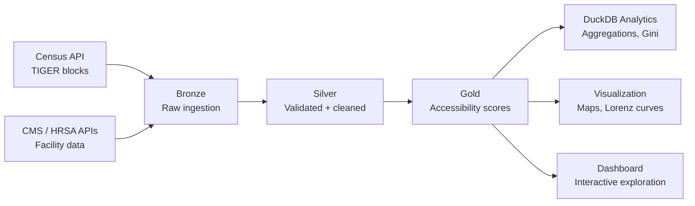
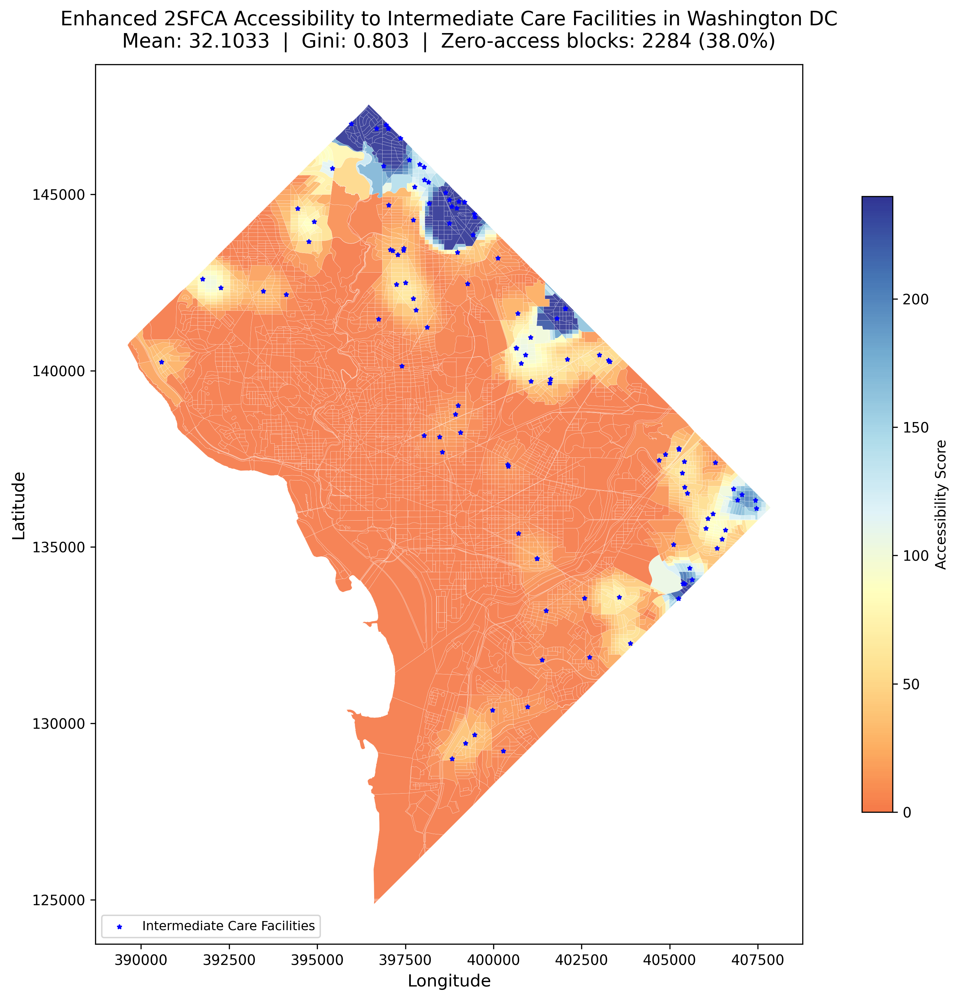
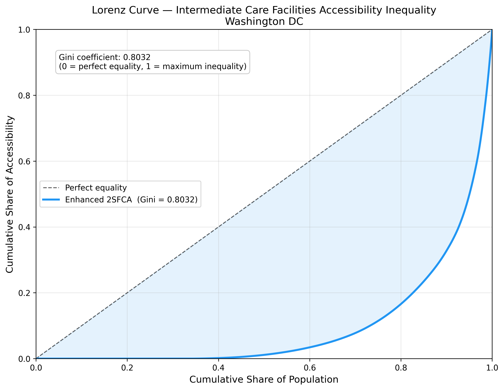
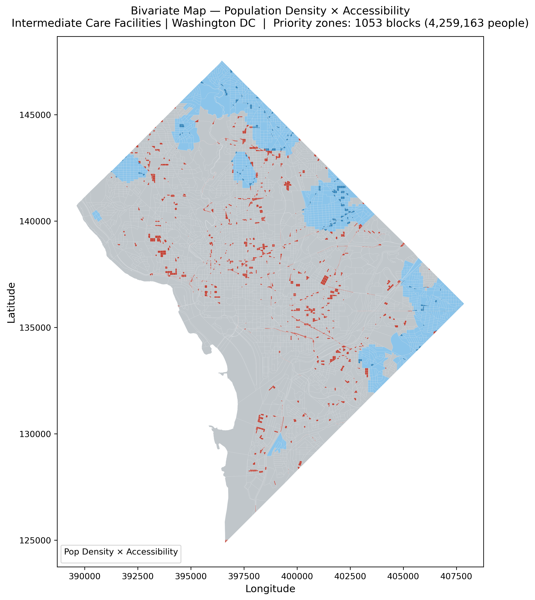

# Spatial Accessibility Pipeline

[](https://github.com/yourusername/healthcare-accessibility-research/actions)
[](https://www.python.org/)
[](LICENSE)

## Overview

The **Spatial Accessibility Pipeline** is an extension of a novel spatial accessibility method developed as part of research at the **Center for Geospatial Information Science, University of Maryland**. The method — **Socio-demographically Weighted Two-Step Floating Catchment Area (SDW-2SFCA)** — addresses a fundamental limitation in traditional healthcare access analysis: conventional 2SFCA treats all residents as imposing equal demand, which systematically underestimates access gaps in low-income, uninsured, and medically vulnerable populations.

This repository transforms that research method into a **production-ready, open-source geospatial data pipeline** that enables health systems, city planners, and policy analysts to:

- **Identify healthcare access deserts** at census block resolution
- **Quantify access inequality** using population-weighted Gini coefficients and Lorenz curves
- **Compare facility networks** across cities, facility types, and policy scenarios
- **Test "what-if" scenarios** interactively (add clinics, change catchment radii, adjust supply assumptions)
- **Reproduce analyses for any jurisdiction** using open data and configuration-driven workflows

### Why This Matters

Where are the neighborhoods a health system leaves behind? Standard proximity-only models answer "who is closest to a clinic," but equity analysis demands a different question: **who is structurally underserved, and by how much?** The SDW-2SFCA framework answers that question rigorously by weighting demand with sociodemographic need, making access deserts and inequality metrics legible to decision-makers.

The engineering architecture turns a single research finding into **reusable infrastructure**: any agency or community group can point the pipeline at their city, configure facility types and catchment radii in a YAML file, and compute accessibility scores from public Census and CMS data — with no proprietary software, no licensing cost, and full reproducibility.

## What’s In The Repo

- `pipeline/` contains the runnable implementation for ingesting Census and CMS data, validating it, computing accessibility, and writing outputs.
- `dags/accessibility_pipeline_dag.py` wires the stages into an Airflow workflow.
- `dashboard/` contains the Streamlit dashboard for exploring accessibility results.
- `case_studies/` stores the per-city configuration used to reproduce the analyses.
- `outputs/figures/` contains the generated maps and comparison plots shown below.
- `notebooks/` documents the exploratory analysis and method development that informed the pipeline.

## Case Studies: Three Cities, Three Facility Types

The pipeline has been applied to three deliberately chosen case studies, each testing different aspects of the method's generalizability and revealing distinct equity stories.

| Study | Facility Type | Census Blocks | Facilities | Population | Catchment | Gini | Key Insight |
|---|---:|---:|---:|---:|---:|---:|---|
| **Washington, D.C.** | Intermediate Care Facilities (ICF) | 6,012 | 114 | 620K | 900 m | **0.8203** | Starkest inequality: outer wards (SE/NE) systematically underserved |
| **New York City** | Dialysis Centers | 37,984 | 154 | 8.3M | 1,200 m | **0.6555** | Facilities cluster in Manhattan; outer boroughs face connectivity barriers |
| **Los Angeles** | Federally Qualified Health Centers (FQHCs) | 65,485 | 630 | 13M | 1,600 m | **0.7186** | More uniform primary care network, but topographic barriers strand pockets |

### Why These Three?

- **Dialysis centers** (NYC) deliver non-optional chronic care whose accessibility is acutely distance-sensitive
- **FQHCs** (LA) are primary-care safety net sites serving underserved populations, a natural fit for equity analysis
- **Intermediate care facilities** (DC) provide long-term specialized care that has received comparatively little attention in accessibility research

Together, they span different care models, geographies, and catchment patterns, testing whether the method generalizes beyond any single facility type.

### Findings

**DC shows the starkest inequality**: a Gini of 0.8203, with zero-access blocks concentrated in outer wards where low-income, uninsured populations face the longest travel distances and the fewest nearby facilities.

**NYC shows moderate inequality** (Gini 0.6555), with dialysis facilities clustering in Manhattan and connectivity challenges in outer boroughs creating pockets of underservice despite overall network density.

**LA falls between them** (Gini 0.7186), with FQHC coverage more widespread but still stranded pockets behind topographical barriers (canyons, mountains) and in areas of sparse settlement.

### Reproducibility

Run any case study with:

```bash
python run_pipeline.py --config case_studies/dc.yaml
python run_pipeline.py --config case_studies/nyc.yaml
python run_pipeline.py --config case_studies/la_fqhc.yaml
```

All parameters (CRS, bbox, catchment radius, decay function, facility type) are defined in the YAML config. See [`case_studies/README.md`](case_studies/README.md) for configuration details.

## The Method: SDW-2SFCA

The **Socio-demographically Weighted 2SFCA (SDW-2SFCA)** framework extends the traditional Two-Step Floating Catchment Area method with two critical refinements:

1. **Socio-demographic demand weighting**: Effective demand at each census block is adjusted by income, health insurance coverage, and working-age population fraction. Low-income, uninsured, and vulnerable populations impose higher effective demand, so accessibility scores reflect need, not just headcount.

2. **Truncated Gaussian distance decay**: Unlike standard exponential decay that approaches zero asymptotically, the truncated Gaussian reaches exactly zero at the catchment boundary, producing cleaner, more interpretable results and eliminating spurious long-distance effects.

### Why It Matters

Standard 2SFCA reports a **Gini coefficient of 0.00** (perfect equality) for DC intermediate care facilities — a result that masks severe structural inequality. The SDW-2SFCA framework reveals a **Gini of 0.8203** for the same network, correctly identifying outer wards as systematically underserved. This is not a mathematical artifact; it is a measurement that respects the real distribution of need.

### Implementation

The method follows the standard two-step floating catchment area structure: first computing facility-to-population ratios within distance thresholds, then aggregating those ratios to produce block-level accessibility scores. The implementation incorporates sociodemographic weights at each step to reflect differential need across populations.

**Performance characteristics:**
- Spatial indexing via `scipy.cKDTree` handles 60,000+ blocks and 600+ facilities in under 2 minutes
- Vectorized distance and weight calculations minimize overhead
- Medallion architecture (Bronze → Silver → Gold) ensures data quality gates before analysis

*Full methodological details and validation are provided in the forthcoming publication from the Center for Geospatial Information Science, University of Maryland.*

## Engineering Architecture

The pipeline is designed as **data engineering infrastructure**, not a one-off research script. It follows industry-standard patterns for reproducibility, testability, and scalability.

### Medallion Architecture (Bronze → Silver → Gold)



**Bronze Layer**: Raw data from Census TIGER (block geometries, population) and CMS/HRSA (facility locations, supply). No transformations, just ingestion with timestamps.

**Silver Layer**: Validated, spatially indexed, and cleaned. Quality gates enforce:
- No null geometries or coordinates
- Population bounds (0 ≤ pop ≤ 100,000)
- Supply bounds (1 ≤ supply ≤ 500)
- CRS consistency
- Geometry validity (fixed via `buffer(0)` where needed)

**Gold Layer**: Analytical-ready accessibility scores with inequality metrics (Gini, Lorenz curve coordinates, zero-access counts). Output as GeoParquet for performance and as shapefiles for legacy GIS tool compatibility.

### Orchestration

- **Airflow DAG** (`dags/accessibility_pipeline_dag.py`) sequences ingestion → validation → transformation → analytics
- **Local execution** via `run_pipeline.py` for development and small jurisdictions
- **Makefile** for common tasks: `make run`, `make test`, `make clean`

### Configuration-Driven Reproducibility

Every study area is defined in a YAML config file:

```yaml
study_area:
  name: "Los Angeles"
  state_fips: "06"
  county_fips: ["037"]
  coordinate_system: "EPSG:32611"
  bbox: [-118.9448, 33.7037, -117.6464, 34.8233]

facility:
  type: "FQHC"
  label: "Federally Qualified Health Centers"
  supply_column: "supply"

analysis:
  distance_threshold_m: 1600
  decay_function: "gaussian"
```

A new city means editing config, not rewriting code. This is the key to reproducibility at scale.

### Data Engineering Features

- **Spatial indexing**: `rtree` and `cKDTree` for fast neighbor queries
- **Batch processing**: distance matrices computed in chunks to avoid memory blowup
- **Graceful degradation**: Census API fallback → local shapefiles → cached snapshots
- **S3 medallion storage**: optional cloud backend for production workflows
- **DuckDB analytics layer**: SQL queries on Gold GeoParquet (Gini, zero-access population, block profiles)
- **Testing**: `pytest` suite with fixtures for sample geometries, known-distance validation, and edge cases

## Decision-Support Capabilities

### Interactive Dashboard for Results Exploration

The **Healthcare Access Intelligence Dashboard** ([dashboard/app_modern.py](dashboard/app_modern.py)) enables planners and analysts to:

- **Switch between three cities**: DC (ICF), NYC (Dialysis), LA (FQHCs)
- **Explore interactive visualizations**:
  - Choropleth maps with red-to-green accessibility color scheme
  - Lorenz curves with Gini coefficients for inequality measurement
  - Priority zone identification (high population + low access areas)
  - Distribution histograms and statistical summaries
- **Export results**: Download data as CSV or GeoJSON for GIS analysis
- **View detailed metrics**: Zero-access population, Gini coefficients, facility counts
- **Modern UI**: Beautiful gradient design with intuitive navigation

### Dashboard Capabilities

**Current Features:**
- Pre-computed accessibility scores from pipeline runs
- Interactive filtering and exploration of results
- Publication-ready visualizations
- Data export functionality
- Cross-city comparative analysis

**Pipeline Features (for scenario testing):**
- Run `python run_pipeline.py --config <modified_config.yaml>` to test different catchment radii
- Edit YAML configs to change facility networks, distance thresholds, or decay functions
- Compare multiple pipeline runs by examining outputs in `outputs/results/` and `outputs/figures/`

### Use Cases

**Health System Planners**: "Which census blocks have the lowest accessibility scores and highest population density?"

**City Officials**: "How does our city's healthcare access inequality compare to similar metros?"

**Community Advocates**: "Show me the Lorenz curve — does the current network treat residents equitably?"

**Researchers**: "Export the accessibility scores and sociodemographic data for regression analysis."

### Architecture: Dashboard vs Pipeline

The **dashboard** displays pre-computed results from pipeline runs, enabling fast exploration without recomputation. For scenario testing (changing parameters, adding facilities), edit the YAML configuration and rerun the pipeline — results are typically ready in 2–5 minutes for cities with 6K–65K blocks.

## Outputs and Visualizations

The pipeline produces publication-ready visualizations that make inequality legible to both technical and non-technical audiences.

### 1. Accessibility Choropleth

Block-level accessibility scores with facility overlays. Color scale uses a softened RdYlBu colormap (red = low access, blue = high access). Map title includes population-weighted Gini coefficient and zero-access block count.



### 2. Lorenz Curve and Gini Coefficient

Population-weighted inequality visualization. The further the curve bows below the diagonal, the greater the inequality. Gini coefficient quantifies the area between the curve and the diagonal.



**Interpretation**: A Gini of 0.8203 means accessibility is highly concentrated in a small fraction of the population. The Lorenz curve shows that 50% of DC residents capture only ~15% of total access.

### 3. Bivariate Map (Population × Accessibility)

2×2 classification identifying priority areas: **high population + low access** = intervention targets.



### 4. Access Gap Chart

Cumulative population with access below threshold values, surfacing the number of residents completely stranded (zero access) or critically underserved.

### Additional Outputs

- **Method comparison maps**: Standard 2SFCA, Gravity, Hansen, Cumulative Opportunity side-by-side
- **DuckDB analytics database**: SQL-queryable Gold layer with aggregations, Gini, zero-access population
- **GeoParquet and Shapefiles**: analysis-ready spatial outputs for QGIS, ArcGIS, or custom tools

## Interactive Dashboard

The **Healthcare Access Intelligence Dashboard** provides a modern, intuitive interface for exploring accessibility results with real-time analysis.

### Quick Launch

**Option 1: Using the Launcher** (Recommended)

```bash
python launch_dashboard.py
```

**Option 2: Direct Streamlit Command**

```bash
streamlit run dashboard/app_modern.py
```

Then navigate to **http://localhost:8501** in your browser.

### Dashboard Features

- **🎨 Modern UI**: Beautiful gradient interface with purple theme and intuitive design
- **🗺️ Interactive Maps**: Red-to-green color scheme (red = low access, green = high access)
- **📊 Inequality Analysis**: Lorenz curves with Gini coefficients for measuring equity
- **🎯 Priority Zones**: Automatic identification of high-population, low-access areas
- **📥 Data Export**: Download results as CSV or GeoJSON for further analysis
- **🏙️ Multi-City Support**: Easily switch between DC, NYC, and LA case studies

### Troubleshooting

- **No data showing?** Run the pipeline first: `python run_pipeline.py --config case_studies/dc.yaml`
- **Data not updating?** Click the ☰ menu → "Clear cache" → "Rerun" to reload
- **Port already in use?** Stop any running Streamlit instances or change the port:
  ```bash
  streamlit run dashboard/app_modern.py --server.port 8502
  ```

**For scenario testing** (changing catchment radii, facility networks, etc.), edit the YAML configuration and rerun the pipeline:
```bash
# Edit case_studies/dc.yaml to change parameters
python run_pipeline.py --config case_studies/dc.yaml
# Results appear in outputs/results/
# Refresh dashboard to see updated data
```

## Quick Start

### Installation

```bash
# Clone the repository
git clone https://github.com/yourusername/healthcare-accessibility-research.git
cd healthcare-accessibility-research

# Create a virtual environment (recommended)
python -m venv venv
source venv/bin/activate  # On Windows: venv\Scripts\activate

# Install dependencies
pip install -r requirements-dev.txt
```

### Prerequisites: Data Access

The pipeline requires either:

**Option A: Census API Key (recommended for live data)**

```bash
export CENSUS_API_KEY="your_key_here"
```

Request a free key at [https://api.census.gov/data/key_signup.html](https://api.census.gov/data/key_signup.html)

**Option B: Local Shapefiles (recommended for reproducibility)**

If APIs are unavailable or you want full reproducibility with local data:

1. Create the data directory:
   ```bash
   mkdir -p data/intermediate_files
   ```

2. Download pre-prepared shapefiles OR use acquisition scripts:
   ```bash
   python scripts/acquire_dc_data.py    # For DC
   python scripts/acquire_nyc_data.py   # For NYC
   python scripts/acquire_la_data.py    # For LA
   ```

3. Configure your YAML to use local data (see "Using Local Data" section below)

### Run the Pipeline

**Entry point**: `run_pipeline.py` — orchestrates all stages from ingestion to visualization.

```bash
# Run a case study (DC, NYC, or LA)
python run_pipeline.py --config case_studies/dc.yaml
python run_pipeline.py --config case_studies/nyc.yaml
python run_pipeline.py --config case_studies/la_fqhc.yaml

# Or use the Makefile
make run
```

**What it does:**
1. **Ingest**: Loads Census blocks and facility data (API or local files)
2. **Validate**: Runs quality gates (Bronze → Silver)
3. **Transform**: Computes SDW-2SFCA accessibility scores (Silver → Gold)
4. **Analytics**: Builds DuckDB database with aggregations and Gini calculations
5. **Visualize**: Generates 5 publication-ready maps and charts

**Outputs** will be written to:
- `outputs/results/` — GeoParquet, shapefiles, CSV, DuckDB database
- `outputs/figures/` — PNG maps, Lorenz curves, bivariate analysis
- `logs/` — execution logs with timing and statistics

### Launch the Dashboard

**Option 1: Quick Launcher** (Easiest)
```bash
python launch_dashboard.py
```

**Option 2: Direct Command**
```bash
streamlit run dashboard/app_modern.py
```

Open your browser to `http://localhost:8501` and:
- Select a city from the sidebar dropdown
- Explore the interactive map with red-to-green accessibility visualization
- View inequality analysis with Lorenz curves and Gini coefficients
- Identify priority zones requiring policy attention
- Export results as CSV or GeoJSON for further analysis

### Using Local Data (When APIs Fail)

The pipeline is designed to work with live Census and CMS APIs, but you can run it entirely from local shapefiles if APIs are unavailable or you want full reproducibility.

**Step 1: Organize your data**

Create a `data/intermediate_files/` directory and place your shapefiles there:

```bash
mkdir -p data/intermediate_files
```

**Required files for each city:**

**DC:**
- Census blocks: `blocks_Washington_DC.shp` (from `acquire_dc_data.py`) OR `blocksandtract_economic_final.shp` (enriched with sociodemographics)
- Facilities: `Intermediate_Care_Facilities.shp` (ICF facilities with bed counts)

**NYC:**
- Census blocks: `blocks_New_York_City.shp` (from `acquire_nyc_data.py`) OR `blocks_New_York_City_enhanced.shp` (enriched with sociodemographics)
- Facilities: `Dialysis_NYC.shp` (dialysis centers with station counts)

**LA:**
- Census blocks: `blocks_Los_Angeles.shp` (from `acquire_la_data.py`) OR `blocks_Los_Angeles_enhanced.shp` (enriched with sociodemographics)
- Facilities: `FQHC_LA.shp` (FQHC facilities)

**Note:** The acquisition scripts (`acquire_*.py`) download basic census blocks with population data. For the full **SDW-2SFCA** method with sociodemographic weighting, you need enriched blocks containing income, insurance, and age variables. The pipeline will run with basic blocks but will skip sociodemographic weighting if those columns are missing.

**Step 2: Update config to use local data**

In your case study YAML file, set:

```yaml
data:
  snapshot:
    use_snapshot: true
  local_shapefiles:
    facilities: "data/intermediate_files/Intermediate_Care_Facilities.shp"
    census_blocks: "data/intermediate_files/blocksandtract_economic_final.shp"
```

**Step 3: Run the pipeline**

```bash
python run_pipeline.py --config case_studies/dc.yaml
```

The pipeline will load from local files instead of APIs, compute accessibility scores, and generate outputs normally.

**Sociodemographic columns required in enriched blocks:**

Your census block shapefile must contain:
- `Bl_totalpo` or `population` — normalized population [0, 1]
- `PerCapitaI` — per-capita income (will be normalized)
- `HI_block` — health insurance coverage fraction (will be normalized)
- `age_18to65` — working-age population fraction (will be normalized)

If using raw (unnormalized) values, the pipeline will min-max normalize them automatically.

**Data acquisition scripts:**

For all three cities, you can use the provided scripts to download and prepare local data:

```bash
python scripts/acquire_dc_data.py   # Downloads DC ICF facilities and blocks
python scripts/acquire_nyc_data.py  # Downloads NYC dialysis centers and blocks
python scripts/acquire_la_data.py   # Downloads LA FQHC facilities and blocks
```

These scripts fetch from public sources (CMS, HRSA, HIFLD, Census TIGER) and save to `data/intermediate_files/`.

### Configure a New City

1. Copy an existing config: `cp case_studies/dc.yaml case_studies/my_city.yaml`
2. Edit study area, facility type, and catchment parameters
3. Run: `python run_pipeline.py --config case_studies/my_city.yaml`

See [`case_studies/README.md`](case_studies/README.md) for required fields.

## Technology Stack

The pipeline is built entirely on **open-source geospatial and data engineering tools**:

**Geospatial:**
- `geopandas` — spatial dataframes and geospatial operations
- `shapely` — geometric objects and topological operations
- `pyproj` — coordinate reference system transformations
- `rtree` / `scipy.cKDTree` — spatial indexing for fast neighbor queries

**Data Engineering:**
- `pandas` — tabular data manipulation
- `duckdb` — embedded analytics database for Gold layer
- `pyarrow` / `geoparquet` — columnar storage format for spatial data
- `pyyaml` — configuration parsing

**Orchestration:**
- `apache-airflow` — DAG-based workflow automation
- `pytest` — testing framework with spatial fixtures

**Visualization:**
- `matplotlib` — publication-quality static maps and charts
- `streamlit` — interactive dashboard framework
- `folium` — web-based interactive maps

**Data Sources:**
- U.S. Census Bureau TIGER / Decennial 2020 (Census API)
- CMS Health Facility datasets (Socrata API)
- HRSA FQHC directory (CSV download)

**All dependencies are free, MIT/BSD-licensed, and installable via pip.**

## Limitations and Caveats

This pipeline is a research tool and decision-support system, not ground truth. Key limitations:

1. **Euclidean distance simplifies real travel**: The method uses straight-line distance, not street-network routing or transit accessibility. For walkable urban areas, this is a reasonable proxy; for car-dependent or topographically complex regions, it may overestimate access.

2. **Catchment radius choices matter**: A 900m threshold vs 1200m threshold can materially change Gini coefficients and zero-access counts. Sensitivity analysis is recommended.

3. **Provider data is messy**: CMS and HRSA datasets have geocoding errors, outdated records, and missing supply metadata. The pipeline includes quality gates, but manual validation is advisable for high-stakes analyses.

4. **Sociodemographic weights are normalized**: Income, insurance, and age fractions are min-max scaled to [0, 1] and combined linearly. Alternative weighting schemes (PCA, domain-expert weights) may be more appropriate for specific use cases.

5. **Static snapshots, not real-time monitoring**: The pipeline computes accessibility for a single point in time. It does not track changes over time or integrate live patient flow data.

**When to use this tool**: Planning, policy analysis, comparative city studies, community advocacy, exploratory scenario testing.

**When NOT to use this tool**: Real-time patient routing, individual-level care navigation, legally binding service area definitions.

## Who This Is For

**Public health analysts and health equity researchers** who need to quantify access inequality rigorously and communicate findings to policymakers.

**Urban planners and city officials** who decide where to site new clinics, fund shuttle routes, or target outreach programs.

**Health system planners** who need to understand service area gaps, test network expansion scenarios, and justify facility investments.

**Community advocates and nonprofit organizations** who want to hold health systems accountable for equitable access.

**GIS practitioners and data scientists** who need a reference implementation of demand-weighted spatial accessibility that they can extend or adapt.

**Data engineers and ML engineers** who want to see a well-architected geospatial pipeline with testing, orchestration, and medallion storage patterns.

## Repository Structure

```
├── pipeline/                      # Core ETL and analysis modules
│   ├── ingest/                    # Census API, CMS API, local shapefile loaders
│   │   ├── census_api.py
│   │   └── cms_api.py
│   ├── validate/                  # Data quality gates
│   │   └── quality_gates.py
│   ├── transform/                 # SDW-2SFCA computation
│   │   ├── sfca_enhanced.py       # Main accessibility algorithm
│   │   └── sfca_2.py              # Standard 2SFCA (comparison baseline)
│   ├── store/                     # Medallion storage (Bronze/Silver/Gold)
│   │   ├── local_store.py
│   │   └── s3_store.py
│   ├── config.py                  # YAML config loader
│   ├── duckdb_query.py            # Analytics layer (Gini, aggregations)
│   └── visualize.py               # Maps, Lorenz curves, bivariate plots
│
├── case_studies/                  # City configurations
│   ├── dc.yaml                    # Washington DC / ICFs
│   ├── nyc.yaml                   # New York City / Dialysis
│   ├── la_fqhc.yaml               # Los Angeles / FQHCs
│   └── README.md                  # Config field documentation
│
├── dashboard/                     # Interactive Streamlit dashboard
│   └── app_modern.py              # **Modern dashboard** with beautiful UI
│
├── dags/                          # Airflow orchestration
│   └── accessibility_pipeline_dag.py
│
├── scripts/                       # Data acquisition scripts
│   ├── acquire_dc_data.py
│   ├── acquire_nyc_data.py
│   ├── acquire_la_data.py
│   └── database/                  # SQL schema definitions
│
├── tests/                         # pytest test suite
│   ├── test_ingest.py
│   ├── test_transform.py
│   ├── test_validate.py
│   └── conftest.py                # Test fixtures
│
├── notebooks/                     # Exploratory analysis (archived)
│   ├── 01_ingest_census.ipynb
│   ├── 02_ingest_facilities.ipynb
│   ├── 03_validate.ipynb
│   ├── 04_transform_2sfca.ipynb
│   └── 05_visualize.ipynb
│
├── outputs/                       # Generated artifacts (gitignored)
│   ├── results/                   # GeoParquet, shapefiles, DuckDB
│   └── figures/                   # PNG maps and charts
│
├── docs/                          # Documentation
│   ├── DATA_ENGINEERING.md        # Medallion architecture details
│   ├── DASHBOARD_DEPLOYMENT.md    # Streamlit hosting guide
│   └── POSTGRES_INSTALLATION.md   # Optional PostGIS setup
│
├── launch_dashboard.py            # Quick dashboard launcher
├── run_pipeline.py                # CLI entrypoint
├── config.yaml                    # Default config (DC study)
├── requirements.txt               # Production dependencies
├── requirements-dev.txt           # Dev dependencies (pytest, jupyter, etc.)
├── Makefile                       # Common tasks (run, test, clean)
├── Dockerfile                     # Container image for deployment
└── docker-compose.yml             # Local orchestration stack
```

## Beyond Healthcare: Broader Applicability

While this pipeline was developed for healthcare access analysis, the **SDW-2SFCA framework and engineering architecture generalize to any spatial accessibility problem** where:

- Resources have limited capacity (supply constraint)
- Demand varies by population characteristics (need-based weighting)
- Travel distance matters (catchment-based analysis)

### Other Domains

**Hazard resilience and climate adaptation:**
- Cooling centers during heat waves (weighted by elderly population, lack of AC)
- Evacuation resources during hurricanes (weighted by mobility-limited populations)
- Food banks and emergency shelters (weighted by poverty, food insecurity)

**Education access:**
- Public schools (weighted by income, special education needs)
- Libraries and community centers (weighted by digital divide, language barriers)

**Transportation equity:**
- Transit stops and bike-share stations (weighted by car ownership, income)
- EV charging infrastructure (weighted by EV adoption, commute distance)

**Environmental justice:**
- Green space and parks (weighted by air quality, population density)
- Pollution exposure vs healthcare access (combined equity metric)

### Method Transferability

The pipeline is designed to be forked and adapted:
- Replace facility data sources with your domain (e.g., USDA food access data, EPA facility registries)
- Adjust sociodemographic weights to match local need (e.g., mobility-limited populations, linguistic isolation)
- Modify catchment parameters (walk, bike, drive, transit)
- Extend with network-based routing (replace Euclidean distance with OSRM / pgRouting)

The configuration-driven design means you can test new domains without rewriting core logic.

## Citation

If you use this pipeline or the SDW-2SFCA method in your research, please cite:

```bibtex
@software{spatial_accessibility_pipeline,
  author = {Ushashi Podder},
  title = {Spatial Accessibility Pipeline: An Open-Source SDW-2SFCA Implementation},
  year = {2026},
  url = {https://github.com/yourusername/healthcare-accessibility-research},
}
```

## References

**Foundational 2SFCA Literature:**

- Luo, W., & Wang, F. (2003). Measures of spatial accessibility to health care in a GIS environment: synthesis and a case study in the Chicago region. *Environment and Planning B: Planning and Design*, 30(6), 865–884. [https://doi.org/10.1068/b29120](https://doi.org/10.1068/b29120)

- Wan, N., Zou, B., & Sternberg, T. (2012). A three-step floating catchment area method for analyzing spatial accessibility to health services. *International Journal of Geographical Information Science*, 26(6), 1073–1089. [https://doi.org/10.1080/13658816.2011.624987](https://doi.org/10.1080/13658816.2011.624987)

**Equity and Demand Weighting:**

- McGrail, M. R., & Humphreys, J. S. (2014). Measuring spatial accessibility to primary health care services: Utilising dynamic catchment sizes. *Applied Geography*, 54, 182–188.

**Geospatial Open Source Tools:**

- Jordahl, K., et al. (2020). geopandas/geopandas: v0.8.1. *Zenodo*. [https://doi.org/10.5281/zenodo.3946761](https://doi.org/10.5281/zenodo.3946761)


## License

MIT License. See [LICENSE](LICENSE) for details.

## Contact and Contributions

**Repository**: [https://github.com/yourusername/healthcare-accessibility-research](https://github.com/yourusername/healthcare-accessibility-research)

**Issues and feature requests**: [GitHub Issues](https://github.com/yourusername/healthcare-accessibility-research/issues)

**Pull requests welcome**. For major changes, please open an issue first to discuss what you would like to change.

---

**Keywords**: spatial accessibility, healthcare equity, 2SFCA, sociodemographic weighting, geospatial data engineering, medallion architecture, GeoParquet, health access deserts, Gini coefficient, Lorenz curve
